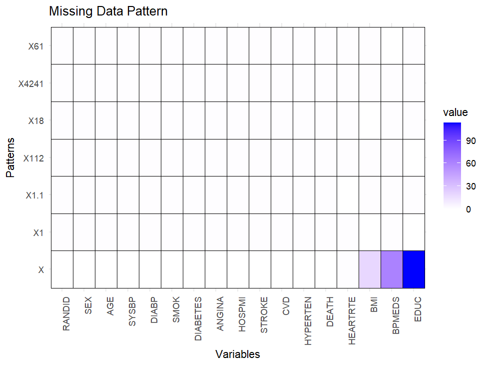

```{r setup, include=FALSE}
knitr::opts_chunk$set(echo = FALSE, message = FALSE, warning = FALSE)
```

---
title: "The Impact of Cigarette Smoking on Hypertension: A 24-Year Case-Control Study from the Framingham Heart Study"
author: |
  Group 17  
  Taymaz Ghaneh  
  Maryam Loni  
  Xixi Zheng
---
# Author contributions are the same

# Abstract

This case-control study investigates the relationship between cigarette smoking (as a binary exposure) and the risk of developing hypertension (as a binary outcome) over 24 years, using data from the Framingham Heart Study. The Framingham Heart Study was a long-term cohort prospective study on cardiovascular diseases conducted in the community of Framingham, Massachusetts. This analysis uses data from the first examination period and the corresponding results after 24 years. The study aims to estimate the causal effect of smoking on the risk of hypertension. Hypertension is defined as receiving treatment for high blood pressure or having a systolic blood pressure 140 mmHg or a diastolic blood pressure 90 mmHg.

# Introduction

This study aims to assess the causal effect of cigarette smoking on the risk of developing hypertension over a 24-year period using data from the Framingham Heart Study, a long-term cohort study focusing on cardiovascular diseases in Framingham, Massachusetts. Hypertension is a major contributor to cardiovascular diseases. Similarly, cigarette smoking is a powerful cardiovascular risk factor that elevates the risk of heart disease, stroke, and other related conditions. Despite well-documented evidence of smoking’s adverse effects on cardiovascular health, the causal relationship between smoking and hypertension remains unclear, and chronic smoking's effect on blood pressure regulation is less understood.

To address this gap, we formulate the research question: *“What is the causal effect of current cigarette smoking on the risk of developing hypertension over 24 years?”* In potential outcome notation, we seek to estimate the average causal contrast (ACE): $ E[Y(1) - Y(0)] $
where $ Y(1) $ represents the hypertension status after 24 years if an individual is a current smoker, and $ Y(0) $ represents the hypertension status if the individual is a non-smoker. But, as the fundamental problem of causality says, one cannot measure these for 1 individual. Therefor we use their population averages $E[Y(1)]$ , $[Y(0)]$, where e.g. $E[Y(1)]$ is the average potential hypertention if we could made all the population smoke (somehow the air pollution in some industrial cities does)! If the identifiability assumption holds, one can measure it by the smokers group of the study sample as $E(Y|X=1)$. Then we will reach average treatment effect (ATE) as an estimation of ACE.

```{r Intro}
rm(list = ls())
library(dagitty)
library(ggplot2)
library(GGally)
library(gridExtra)

getwd()
setwd('D:/Leiden Studies/CAUSAL inference I - Group 17/Group Assignment')
data = data.frame(read.csv('2025_framingham_assignment.csv'))
data$HYPERTEN = 0
data[data$SYSBP >= 140 | data$DIABP>= 90 , 'HYPERTEN'] = 1
```

# Data Exploration and Missing Data

## Data Exploration

First we take a look at the proportion cross-table between the exposure and the income

```{r CrossTable}
tab = table(data$CURSMOKE, data$HYPERTEN)
round(prop.table((tab), 1),3)
```

As shown in the table above, 67% of individuals with hypertension are current smokers, whereas 78% of those with hypertension are non-smokers.

To examine the pattern of missing data, the md.pattern() function was applied:


Out of 4,241 observations, 194 were missing, primarily affecting the variables Education, BPMEDS (use of anti-hypertensive medication), and BMI. Based on the observed pattern of missingness, we initially assumed that the probability of a value being missing was independent of other variables. To test this assumption, we used the Little’s MCAR test from the mice package. The resulting p-value was $1.137078 * 10^{-6}$, which is significantly lower than the standard threshold of 0.05. Therefore, we rejected the null hypothesis, indicating that the missingness mechanism is not MCAR. Based on the information about the study, it can be assumed that the missing data mechanism is not MNAR.
Thus a Liklihood-based outcome modeling is used to handle the missing data analysis. Note that though less than 5 percent of data is missed, using 'complet-cases' method could not be a good choice, not only due to loss of efficiency, but also since it is biased if the mechanism is not MCAR.
By running some Local Tests and asking for Adjustment Sets via 'dagitty' package in R, ${AGE, DIABETES, EDUC, SEX}$ were found as the set of confounders.
Due to the smallness of this set, it was not computationally intensive to select "outcome modeling by adjusting for confounders" as the best method to condition on confounding here.
Although, methods like G-computation or Inverse Probability Weighting by Propensity Score is not used here, but proportion graphs are used to get an initial insight about validity of conditional exchangability. Also, an overview of LOVE plots is used to check whether IPW can resolve the balanceness problems or not.
As follows, the LOVE plots suggest that adjusting for AGE, BMI, SEX by IPW can solve their balanceness problem. 
By the way, step-wise model selection methods can be helpful in final decision to include other covariates in the model. Use of the "best subset selection" method suggests that the logistic model " $HYPERTEN$ ~ $CURSMOKE + AGE + BMI + HEARTRTE$ " is a winner of model camparisons. 


## Missing Data

In the dataset, some measurements were not recorded due to various reasons. To examine the pattern of missing data, the `md.pattern()` function was applied.

```{r, echo=FALSE, fig.cap="Missing data pattern", fig.width=9, fig.height=1.5, out.width="70%", out.height="15%"}

```

Out of 4,241 observations, 194 were missing, primarily affecting the variables Education, BPMEDS (use of anti-hypertensive medication), and BMI. The resulting p-value from Little’s MCAR test was $ 1.137078 * 10^{-6} $, which is significantly lower than 0.05. Therefore, we rejected the null hypothesis, indicating that the missingness mechanism is not MCAR. A likelihood-based outcome modeling approach was used to handle the missing data analysis.

# Materials and Methods

First, it is required to check causal assumptions for identifiability purpose. To check the validity or possible violations of Positivity assumption, we made some density plots. The sufficient acceptable overlaps and non-zero probabilities show that the positivity holds. 
For checking the possibly existed Conditional Exchangabilities, one can refer to the following proportion barplots. These plots try to answer the question whether exposed and non-exposed groups (to smoking) are exchangable within each level of confounders (levels of sex, levels of diabetes, ...) or not. The plots show that such an exchangability is acceptably present for the Education levels, but not for the other covariates.

```{r Pos,fig.width=8, fig.height=2, out.width="80%", out.height="30%"}
# positivity check
par(mfrow=c(2,2))
library(ggplot2)
library(gridExtra)

a = 6 ;  b = 8 ;  c = 8

density1 = ggplot(data, aes(x=AGE, fill=factor(CURSMOKE))) + 
  geom_density(alpha=0.5) +
  labs(title="AGE by CURSMOKE")+
  theme( legend.position = "none",
    plot.title = element_text(size = a),  # Title font size
    axis.title.x = element_text(size = b),  # X-axis label font size
    axis.title.y = element_text(size = c) )  # Y-axis label font size (if needed)


density2 = ggplot(data, aes(x=BMI, fill=factor(CURSMOKE))) + 
  geom_density(alpha=0.5) +
  labs(title="BMI by CURSMOKE")+
  theme( legend.position = "none",
         plot.title = element_text(size = a),  # Title font size
         axis.title.x = element_text(size = b),  # X-axis label font size
         axis.title.y = element_text(size = c) )

grid.arrange(density1, density2, ncol = 2, nrow=1)

```

```{r Exc, fig.width=8, fig.height=2, out.width="80%", out.height="30%"}
# For checking the possibly existed Conditional Exchangabilities, one can refer to the following proportion barplots. These plots try to answer the question whether exposed and non-exposed groups (to smoking) are exchangable within each level of confounders (levels of sex, levels of diabetes, ...) or not.
# The plots show that such an exchangability is acceptably present for the BMI levels, but not for the other covariates. 


# Proportion of Smokers by Age Group
# Smoker Percentage (blue)
bar1 = ggplot(data, aes(x = cut(AGE, 
                         breaks = c(30, 40, 50, 60, 70), 
                         labels = c("30-40", "40-50", "50-60", "60-70"), 
                         include.lowest = TRUE)
                 , fill = factor(CURSMOKE))) +
  geom_bar(position = "fill") +  
  labs(title = "", 
       x = "Age Group", 
       y = "Smoker (blue) / non-Smoker (pink)  Percentage") +
  scale_fill_manual(values = c("pink","steelblue"), 
                    name = "Smoking Status",
                    labels = c("Non-Smoker", "Smoker")) +
  scale_y_continuous(labels = scales::percent)  +
  theme( legend.position = "none",
         plot.title = element_text(size = a),  # Title font size
         axis.title.x = element_text(size = b),  # X-axis label font size
         axis.title.y = element_text(size = c) ,
         panel.grid.major = element_blank(),
         panel.grid.minor = element_blank(),
         axis.text.x = element_text(angle = 90, vjust = 0.5, hjust = 1))


# Proportion of Smokers by Diabetes
bar2 = ggplot(data, aes(x = factor(DIABETES), fill = factor(CURSMOKE))) +
  geom_bar(position = "fill") +  
  labs(title = "", 
       x = "Diabetes", 
       y = "") +
  scale_fill_manual(values = c("pink","steelblue"), 
                    name = "Smoking Status",
                    labels = c("Non-Smoker", "Smoker")) +
  scale_x_discrete(labels = c("0" = "No", "1" = "Yes")) +  # Custom labels
  scale_y_continuous(labels = scales::percent) +
  theme( legend.position = "none",
         plot.title = element_text(size = a),  # Title font size
         axis.title.x = element_text(size = b),  # X-axis label font size
         axis.title.y = element_text(size = c) ,
         panel.grid.major = element_blank(),
         panel.grid.minor = element_blank(),
         axis.text.x = element_text(angle = 90, vjust = 0.5, hjust = 1))

# Proportion of Smokers by Education
bar3 = ggplot(data, aes(x = factor(EDUC), fill = factor(CURSMOKE))) +
  geom_bar(position = "fill") +  
  labs(title = "", 
       x = "Education", 
       y = "") +
  scale_fill_manual(values = c("pink","steelblue"), 
                    name = "Smoking Status",
                    labels = c("Non-Smoker", "Smoker")) +
  scale_x_discrete(labels = c("0" = "No", "1" = "Yes")) +  # Custom labels
  scale_y_continuous(labels = scales::percent) +
  theme( legend.position = "none",
         plot.title = element_text(size = a),  # Title font size
         axis.title.x = element_text(size = b),  # X-axis label font size
         axis.title.y = element_text(size = c) ,
         panel.grid.major = element_blank(),
         panel.grid.minor = element_blank(),
         axis.text.x = element_text(angle = 90, vjust = 0.5, hjust = 1))


# Proportion of Smokers by Sex
bar4 = ggplot(data, aes(x = factor(SEX), fill = factor(CURSMOKE))) +
  geom_bar(position = "fill") +  
  labs(title = "", 
       x = "Sex", 
       y = "") +
  scale_fill_manual(values = c("pink","steelblue"), 
                    name = "Smoking Status",
                    labels = c("Non-Smoker", "Smoker")) +
  scale_x_discrete(labels = c("1" = "Male", "2" = "Female")) +  # Custom labels
  scale_y_continuous(labels = scales::percent)  +
  theme( legend.position = "none",
         plot.title = element_text(size = a),  # Title font size
         axis.title.x = element_text(size = b),  # X-axis label font size
         axis.title.y = element_text(size = c) ,
         panel.grid.major = element_blank(),
         panel.grid.minor = element_blank() ,
         axis.text.x = element_text(angle = 90, vjust = 0.5, hjust = 1) )

# Proportion of Smokers by BMI Group
bar5 = ggplot(data, aes(x = cut(BMI, 
                         breaks = c(15, 30, 45, 60), 
                         labels = c("15-30", "30-45", "45-60"), 
                         include.lowest = TRUE)
                 , fill = factor(CURSMOKE))) +
  geom_bar(position = "fill") +  
  labs(title = "", 
       x = "BMI Group", 
       y = "") +
  scale_fill_manual(values = c("pink","steelblue"), 
                    name = "Smoking Status",
                    labels = c("Non-Smoker", "Smoker")) +
  scale_y_continuous(labels = scales::percent)  +
  theme( legend.position = "none",
         plot.title = element_text(size = a),  # Title font size
         axis.title.x = element_text(size = b),  # X-axis label font size
         axis.title.y = element_text(size = c),
         panel.grid.major = element_blank(),
         panel.grid.minor = element_blank(),
         axis.text.x = element_text(angle = 90, vjust = 0.5, hjust = 1) )

grid.arrange(bar1, bar2, bar3, bar4, bar5,  ncol = 5, nrow=1)
```


The consistency check is postponed to the next section when we are going to discuss a possible problem of multi-version exposure definition.

As mentioned before, an overview of LOVE plots is used just to check whether IPW can resolve the balanceness problems or not.
As follows, the LOVE plots suggest that adjusting for AGE, BMI, SEX by IPW can mostly solve their balanceness problem. 

```{r LOVE, message = FALSE, warning = FALSE, fig.width=8, fig.height=2, out.width="80%", out.height="30%"}
# Drawing LOVE Plot:
library(cobalt)
library(survey)

# Define confounder set
confounders <- c("EDUC", "AGE", "SEX", "DIABETES", "BMI", "HEARTRTE", "DEATH")

# Function to estimate ACE using IPW
estimate_ACE <- function(confounders, plot_title) {
  
  # Step 1: Remove rows with missing values in CURSMOKE or any of the confounders
  data_clean <- na.omit(data[, c("CURSMOKE", confounders, "HYPERTEN")])  # Assuming HYPERTEN is the outcome variable
  
  # Step 2: Estimate propensity scores using glm
  ps_model <- glm(CURSMOKE ~ ., data = data_clean[, c("CURSMOKE", confounders)], family = binomial())
  data_clean$propensity_score <- fitted.values(ps_model)
  
  # Step 3: Calculate inverse probability weights (IPW)
  data_clean$weights <- ifelse(data_clean$CURSMOKE == 1, 1 / data_clean$propensity_score, 1 / (1 - data_clean$propensity_score))
  
  # Step 4: Estimate ATE using weighted logistic regression (glm)
  ace_model <- glm(HYPERTEN ~ CURSMOKE, data = data_clean, weights = weights, family = binomial())
  
  # Step 5: Extract ATE (log odds difference)
  ATE <- coef(ace_model)["CURSMOKE"]
  
  # Convert ATE from log odds to risk difference (optional)
  ATE_rd <- plogis(coef(ace_model)["CURSMOKE"]) - plogis(0)
  
  # Print ACE estimation result (both log odds and risk difference)
  print(paste("ATE (Log Odds) for", plot_title, ":", round(ATE, 4)))
  print(paste("ATE (Risk Difference) for", plot_title, ":", round(ATE_rd, 4)))
  
  # Step 6: Check balance using LOVE plot (from cobalt package)
  covariates <- data_clean[, confounders]  # Subset data for covariates
  # bal.tab(covariates, treat = data_clean$CURSMOKE, weights = data_clean$weights, method = "weighting", un = TRUE)  # Balance check
  love.plot(covariates, treat = data_clean$CURSMOKE, weights = data_clean$weights, method = "weighting", binary = "std", threshold = .1)  # LOVE plot
}

# Run the analysis for any confounder set:
estimate_ACE(confounders, "Confounders: EDUC, AGE, SEX, DIABETES, BMI, HEARTRTE")


```

# Results

Starting with an elaborate logistic regression model that included higher-order terms and interactions, the main challenge was finding a balance between two competing priorities: ensuring the significance, interpretability, and simplicity of parameter estimates while also enhancing the model’s robustness by accounting for as many potential confounders as possible. Eventually, the best decision made by integrating all above discussions is a logistic regression that models HYPERTEN risk against CURSMOKE exposure and potential confounders AGE, DIABETES, EDUC, SEX, and the interaction SEX:AGE.
The following shows the DAG of the model

```{r DAG,fig.width=8, fig.height=1.5, out.width="80%", out.height="15%"}
# Model DAG :
g.model <- dagitty('dag {
  SEX [pos="-1, 2"]
  AGE [pos="-3.7, 0.5"]
  CURSMOKE [pos="-4, 1.3"]
  DIABETES [pos="-3, 1.9"]
  HYPERTEN [pos="-0.3,1.48"]
  EDUC [pos="-0.5, 0.4"]
  
  SEX -> { CURSMOKE HYPERTEN }
  AGE  -> { CURSMOKE HYPERTEN }
  CURSMOKE  -> { HYPERTEN }
  DIABETES -> { CURSMOKE HYPERTEN }
  EDUC -> { CURSMOKE HYPERTEN }
  AGE <-> { SEX }
  }
')

par(mfrow=c(1,1))
plot(g.model, layout = "circle") 

```

The summary of the model follows

```{r MODEL}
model_best = glm(HYPERTEN ~ CURSMOKE + AGE + DIABETES + EDUC + SEX + SEX:AGE , family = binomial, data = data)
summary(model_best)

## Call:
##   glm(formula = HYPERTEN ~ CURSMOKE + AGE + DIABETES + EDUC + SEX + 
##         SEX:AGE, family = binomial, data = data)
## 
## Coefficients:
##   Estimate Std. Error z value Pr(>|z|)    
##   (Intercept)  1.457350   0.657767   2.216  0.02672 *  
##   CURSMOKE    -0.222241   0.070263  -3.163  0.00156 ** 
##   AGE         -0.035958   0.012702  -2.831  0.00464 ** 
##   DIABETES     0.535496   0.199304   2.687  0.00721 ** 
##   EDUC        -0.240946   0.076252  -3.160  0.00158 ** 
##   SEX         -3.641968   0.420245  -8.666  < 2e-16 ***
##   AGE:SEX      0.071369   0.008121   8.788  < 2e-16 ***
##   ---
##   Signif. codes:  0 ‘***’ 0.001 ‘**’ 0.01 ‘*’ 0.05 ‘.’ 0.1 ‘ ’ 1
## 
## (Dispersion parameter for binomial family taken to be 1)
## 
## Null deviance: 5671.1  on 4320  degrees of freedom
## Residual deviance: 5151.3  on 4314  degrees of freedom
## (113 observations deleted due to missingness)
## AIC: 5165.3
## 
## Number of Fisher Scoring iterations: 4


# Note that the logit(Pr(HYPERTEN=1)) is 0.222241 lesser in zero-age (newly born!!) males with no education and no diabetes who were currently smoking at the date of visit, rather than non-smokers! Of course, either this extrapolation or the estimated intercept are not interpretable for newly born smokers!!


```


Now, this is where one can estimate the potential outcomes and the Risk Difference (i.e. ATE for binary outcome)

```{r ATE}
# codes like those from practical answers of week4 lecture:

data.1 = data
data.1$CURSMOKE = 1

EYhat1 = predict(model_best, newdata = data.1, type = "response")
EY1<-mean(EYhat1,na.rm=T)
# EY1  # 0.3413692

data.0 = data
data.0$CURSMOKE = 0

EYhat0 = predict(model_best, newdata = data.0, type = "response")
EY0<-mean(EYhat0,na.rm=T)
# EY0  # 0.3872214

rd = EY1-EY0 # ATE  -0.04751522 
rr = EY1/EY0
or = EY1*(1-EY0)/(EY0*(1-EY1))
c("E(Y|0)"= EY0, "E(Y|1)"=EY1, "RD"=rd, "RR"=rr, "OR"=or)
## (0.38722140 , 0.34136924 , -0.04585217 , 0.88158669 , 0.82021291)
```

# Conclusions

Note that Risk-Difference is about -4.5%. This means the smokers are slightly less likely to suffer from Hypertension than non-smokers! 

To check whether the above RD is significant or not, one needs to estimate the confidence intervals:

```{r CI}
library(stdReg)
fit.std = stdGlm(fit = model_best, data = data, X = "CURSMOKE")
summary(fit.std)
#ATE 95%CI 
ate.std = summary(fit.std, contrast = 'difference', reference = 0)
ate.std
##   Estimate Std. Error lower 0.95 upper 0.95
## 1  -0.0459     0.0146    -0.0744    -0.0173
```

The confidence interval for that estimation is (-7.4% , -1.7%) which does not contain zero. This means we are 95% confident (in 95 cases out of 100) that the Risk Difference cannot be zero in any way (i.e. nowhere in the interval). Thus, the 4.5% difference is significant.
But this looks awkward that the smoking reduces the chance for hypertension! Perhaps some smokers in the study were also using another medication that was helping to stabilize the blood pressure. We tried to take BPMEDS in to account by controlling for it in the model, but it did not resolved the problem. 
Naming such an unmeasured factor as medic.X, one can suggest that this is a mediator which is affected by the exposure (smokers are more likely to consume medic.X) and affecting the outcome (medic.X could influence the hypertension risk). Considering such a mediator in re-defining the exposure levels could perhaps solve the problem of a not well-defined (multi-version) exposure:  i.e. instead of considering 2 levels of exposure (smokers / non-smokers), one should consider 3 levels. 

However, same calculations can be done for Average Treatment Effect in the exposed sub-group (ATT), showing just a slight difference:
```{r}
# ATT
# dataset with only the treated individuals
fit.std.treat = stdGlm(fit = model_best, data = data, X = "CURSMOKE", subsetnew = (CURSMOKE == 1) )
summary(fit.std.treat)
att.std = summary(fit.std.treat, contrast = 'difference', reference = 0)
att.std

## Estimate Std. Error lower 0.95 upper 0.95
## 0    0.354     0.0111      0.332      0.375
## 1    0.308     0.0100      0.289      0.328
```

```{r eval=FALSE}
######################    APPENDIX    ################


# removing missing values
data_clean = data
miss = numeric(nrow(data_clean))
for (i in 1:nrow(data_clean)) {
  if (any(is.na(data_clean[i,]))) {miss[i]=T}
  else miss[i]=F
}
data_clean = data_clean[which(miss==F),]


# postulated DAG :
g.postulated <- dagitty('dag {
  SEX [pos="-1, 2"]
  AGE [pos="-3.7, 0.5"]
  CURSMOKE [pos="-0.5, 0.4"]
  DIABETES [pos="-3, 1.9"]
  BPMEDS [pos="-2.5, 0"]
  BMI [pos="-4, 1.3"]
  HEARTRTE [pos="0, 1"]
  HYPERTEN [pos="-2, 1.2"]
  EDUC [pos="0,2"]
  
  SEX -> { CURSMOKE DIABETES BMI HEARTRTE HYPERTEN }
  AGE  -> { CURSMOKE DIABETES BMI HEARTRTE HYPERTEN BPMEDS }
  CURSMOKE  -> { BMI HEARTRTE HYPERTEN BPMEDS }
  DIABETES -> { BMI HEARTRTE HYPERTEN BPMEDS }
  BPMEDS -> HYPERTEN
  BMI -> { BPMEDS HYPERTEN }
  HEARTRTE -> { BPMEDS HYPERTEN }
  EDUC -> {CURSMOKE }
  }
')

plot(g.postulated, layout = "circle") 


# testing the postulation with data :
r1 = localTests(g.postulated, data)
r2 = r1[p.adjust(r1$p.value) < 0.05, ]
r3 = r2[order(r2$p.value), ]


par(mar = c(4,6,4,1))
plotLocalTestResults(r3, bty = "n", xlim = c(-0.4, 0.4), ylim = c(0.1, 3.1),
                     axis.pars = list(las = 1, lty = 0, cex.axis = 0.6))


# amended DAG :
g.amended <- dagitty('dag {
  SEX [pos="-1, 2"]
  AGE [pos="-3.7, 0.5"]
  CURSMOKE [pos="-0.5, 0.4"]
  DIABETES [pos="-3, 1.9"]
  BPMEDS [pos="-2.5, 0"]
  BMI [pos="-4, 1"]
  HEARTRTE [pos="0, 1"]
  HYPERTEN [pos="-2, 1.2"]
  EDUC [pos="-0.3,1.48"]
  
  SEX -> { CURSMOKE DIABETES BMI HEARTRTE HYPERTEN BPMEDS }
  AGE  -> { CURSMOKE DIABETES HEARTRTE HYPERTEN BPMEDS EDUC BMI }
  CURSMOKE  -> { BMI HEARTRTE HYPERTEN BPMEDS }
  DIABETES -> { BMI HEARTRTE HYPERTEN BPMEDS CURSMOKE }
  BPMEDS -> HYPERTEN
  BMI -> { BPMEDS HYPERTEN HEARTRTE }
  HEARTRTE -> { BPMEDS HYPERTEN }
  EDUC -> { CURSMOKE BMI HEARTRTE HYPERTEN }
  }
')


plot(g.amended, layout = "circle") 


# testing the amended with data :
r = localTests(g.amended, data)
r = r[p.adjust(r$p.value) < 0.05, ]
r = r[order(r$p.value), ]


# asking for all adjustment sets (confounders we have to adjust for)
adjustmentSets(g.amended, exposure = "CURSMOKE", outcome = "HYPERTEN", type = "all")
# asking for minimal adjustment sets (the most important confounders) 
adjustmentSets(g.amended, exposure = "CURSMOKE", outcome = "HYPERTEN")


######################

# Step-wise Model Selection

# Select specific columns and create a new dataframe
data_extract <- data[, c("HYPERTEN", "CURSMOKE", "AGE", "EDUC", 
                         "SEX", "BMI", "DIABETES", "HEARTRTE", "RANDID")]


x = as.matrix( data_extract[ , !names(data_extract)%in% c("HYPERTEN","RANDID") ] )
y = data_extract$HYPERTEN

n <- length(y)

set.seed(123)
train_idx <- sample(1:n, size = n*.8)

train_dat <- data_extract[ train_idx, !names(data_extract)%in% c("RANDID")]
test_dat  <- data_extract[-train_idx, !names(data_extract)%in% c("RANDID")]

x_train <- model.matrix(HYPERTEN ~ . -1, train_dat)     
x_test  <- model.matrix(HYPERTEN ~ . -1, test_dat )
y_train <- train_dat$HYPERTEN
y_test  <-  test_dat$HYPERTEN   


# Stepwise selection (AIC/BIC)

# the research question is about 'CURSMOKE', thus we have to use 
# the 'scope' argument to ensure "CURSMOKE" is always included in the model:
# ^2 tells R to also include all possible first-order interactions (in addition to all main effects)
full_model    <- glm(HYPERTEN ~ .^2, data = train_dat, family = binomial)
reduced_model <- glm(HYPERTEN ~ CURSMOKE, data = train_dat, family = binomial)  # Minimum model with CURSMOKE
stepwise_model<- step(full_model, scope = list(lower = reduced_model, upper = full_model), direction = "both")
# scope = list() forces "CURSMOKE" to always stay in the model."CURSMOKE"
# cannot be removed because it’s in the lower bound of model selection.

summary(stepwise_model)


#####################


# best model according to LOVE plots
model3 = glm(HYPERTEN ~ CURSMOKE + AGE + BMI + SEX , family = binomial, data = data)
summary(model3)
# best model according to DAG adjustmentSets()
model4 = glm(HYPERTEN ~ CURSMOKE + AGE + DIABETES + EDUC + SEX , family = binomial, data = data)
summary(model4)
# best model according to stepwise model selection ( step() ) and cross-validation ( cv.glmnet() ) without interactions :
model5 = glm(HYPERTEN ~ CURSMOKE + AGE + BMI + HEARTRTE , family = binomial, data = data)
summary(model5)


model_best = glm(HYPERTEN ~ CURSMOKE + AGE + DIABETES + EDUC + SEX + SEX:AGE , family = binomial, data = data)
summary(model_best)

```

